# Table of Contents
0. [Top Level Graph](#top-level-graph)
1. [Title Info](#title-info)
2. [Name](#name)
3. [Type of Resource](#type-of-resource)
4. [Genre](#genre)
5. [Origin Info](#origin-info)
6. [Language](#language)
7. [Physical Description](#physical-description)
8. [Abstract](#abstract)
9. [Table of Content](#table-of-content)
10. [Target Audience](#target-audience)
11. [Notes](#notes)
12. [Subject](#subject)
13. [Classification](#classification)
14. [Related Item](#related-item)
15. [Identifier](#identifier)
16. [Location](#location)
17. [Access Condition](#access-condition)
18. [Part](#part)
19. [Extension](#extension)
20. [Record Info](#record-info)
21. [Module Role](#module-role)
22. [Module Language Attributes](#module-language-attributes)
23. [Module Link Attribute](#module-link-attributes)
24. [Module Date Info](#module-date-info)
25. [Module Place](#module-place)
26. [Module Geographic Subject](#module-geographic-subject)
27. [Module Cartographics](#module-cartographics)
28. [Module Authority](#module-authority)

## Top Level Graph

## Title Info

## Name
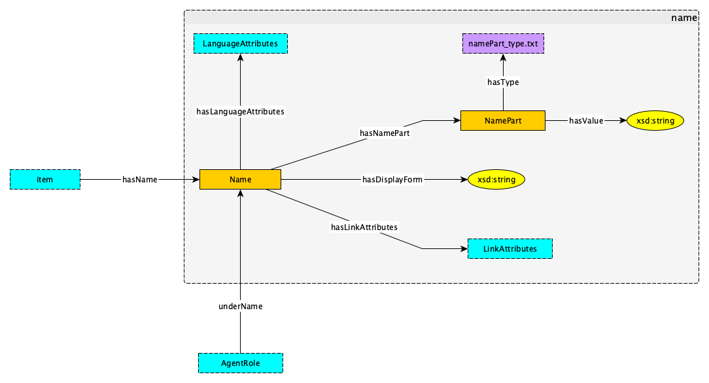

## Type of Resource
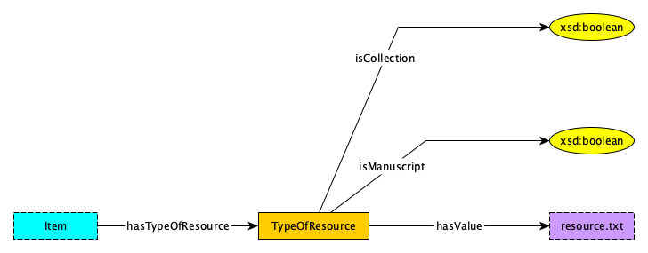

## Genre
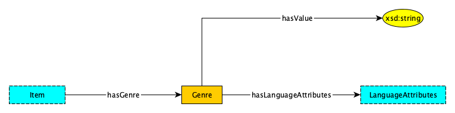

## Origin Info

## Language
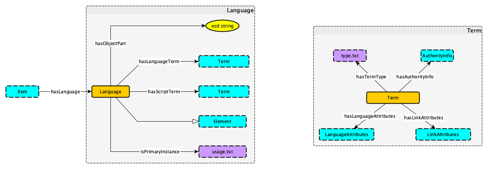

## Physical Description

## Abstract
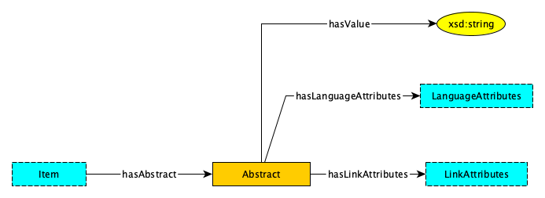

## Table of Content
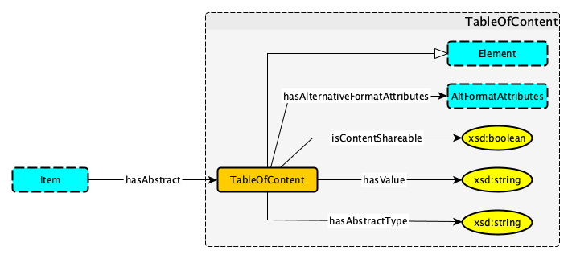

## Target Audience
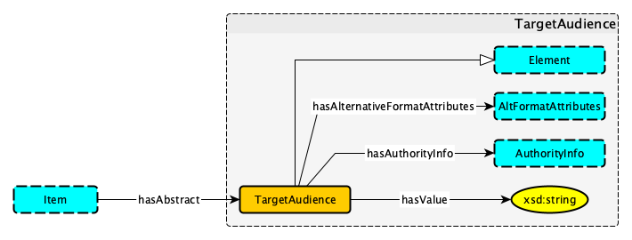

## Notes
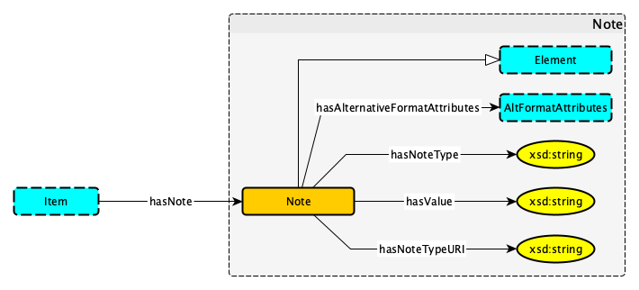

## Subject
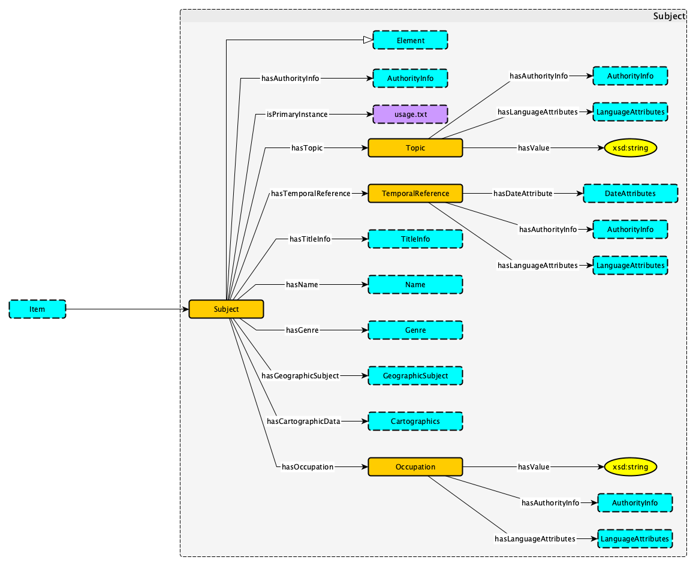

## Classification
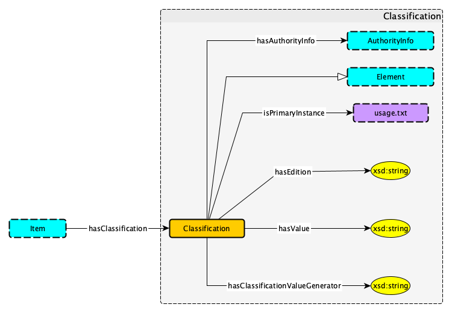

## Related Item
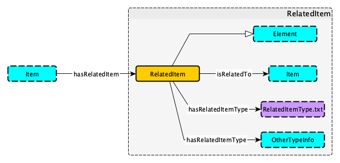

## Identifier
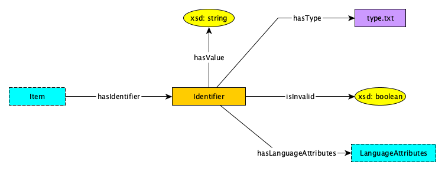

## Location
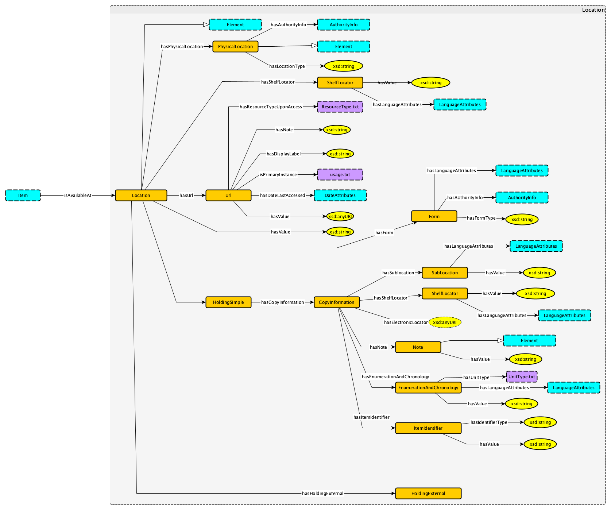

## Access Condition
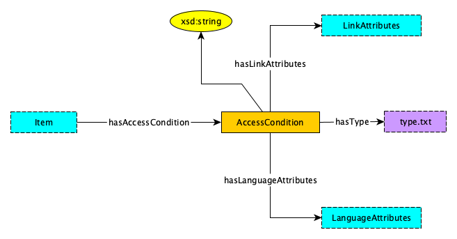

## Part
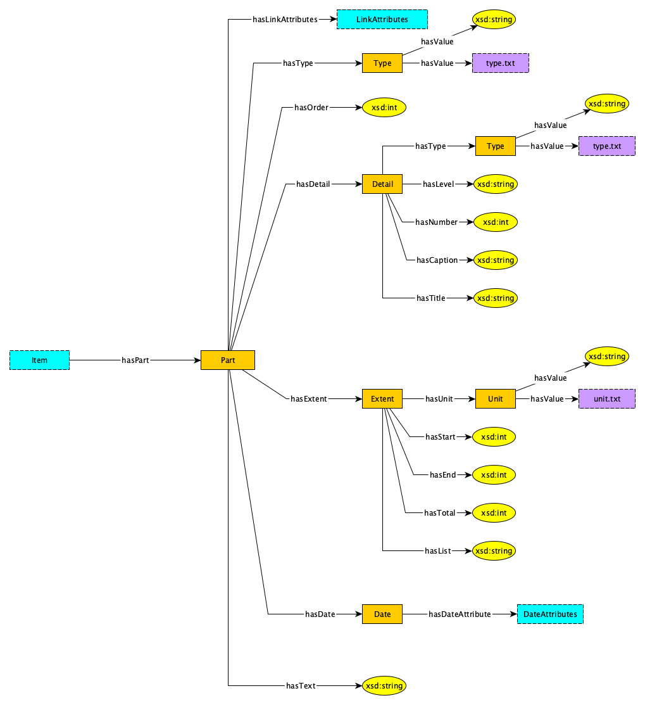

## Extension (Needs Work)
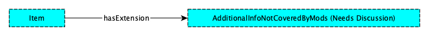

## Record Info
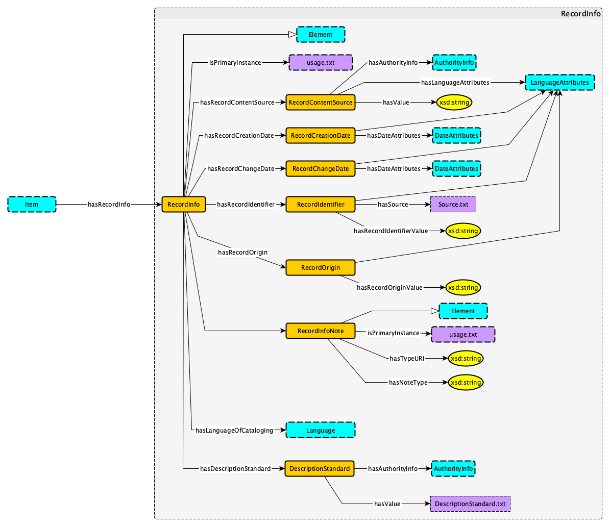

## Module Role
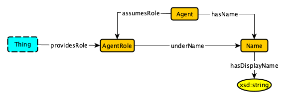

## Module Language Attributes
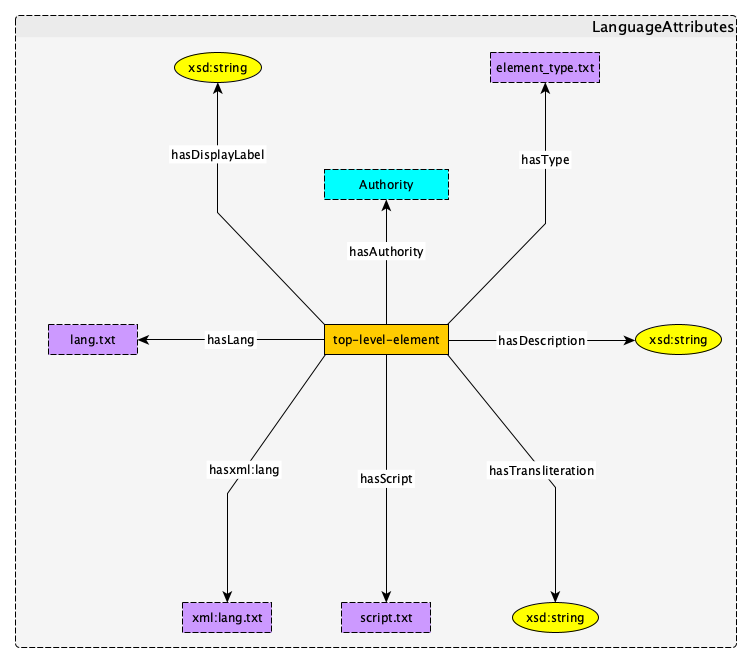

## Module Link Attributes

## Module Date Info
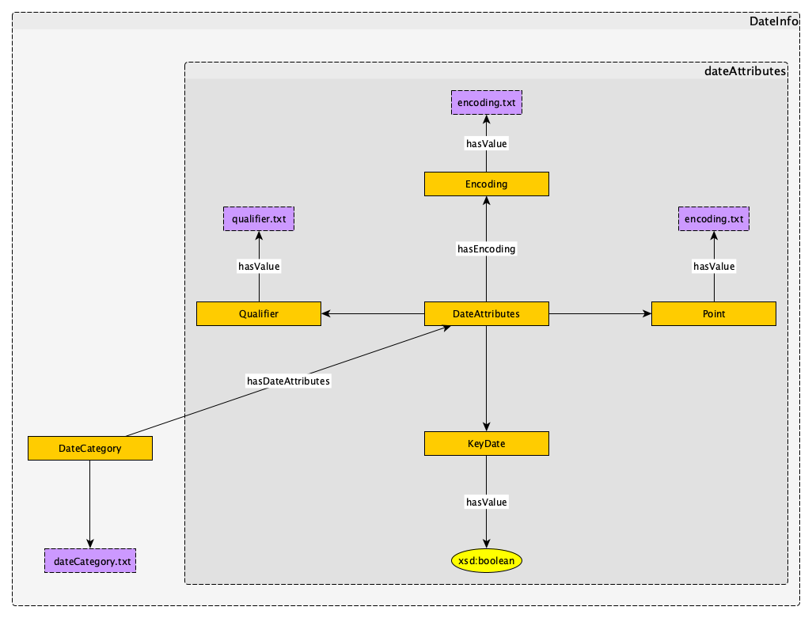

## Module Place
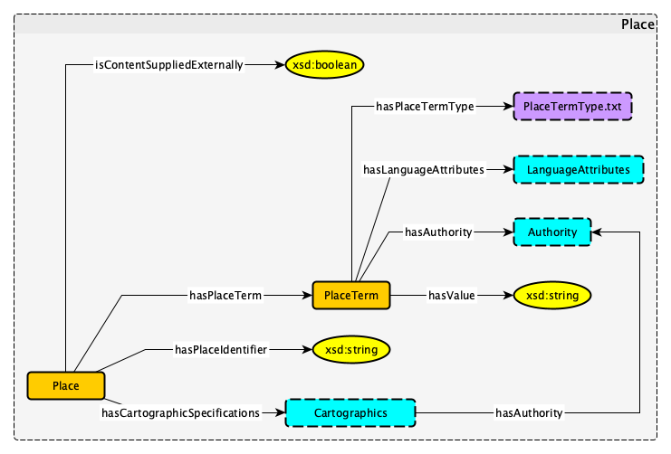

## Module Geographic Subject
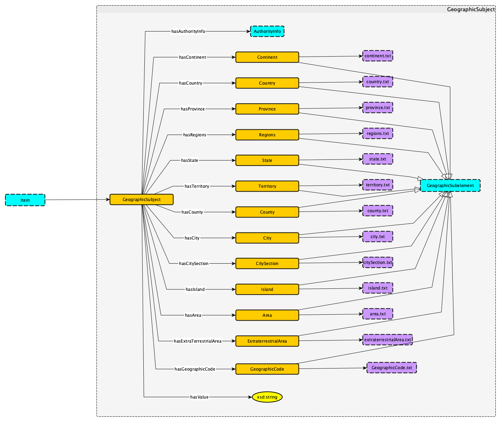

## Module Cartographic
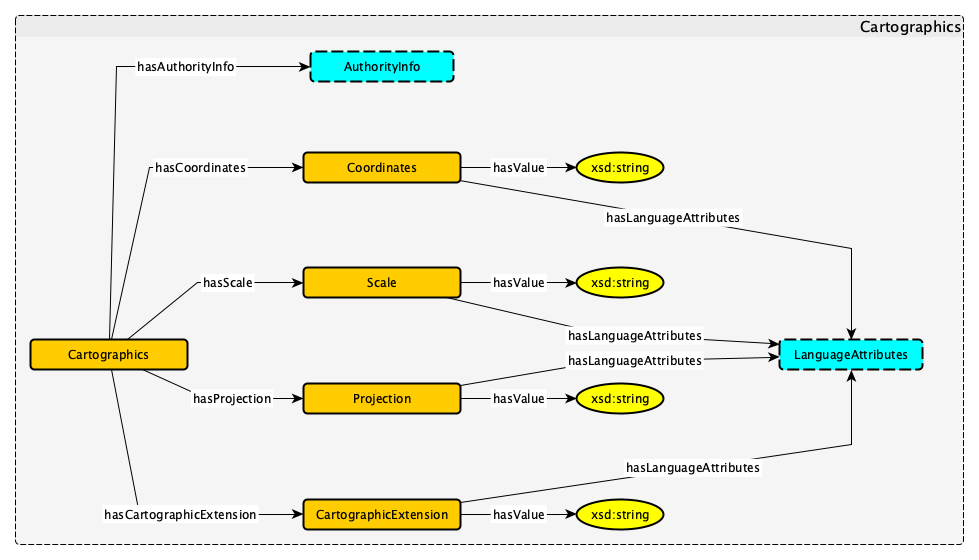

## Module Authority
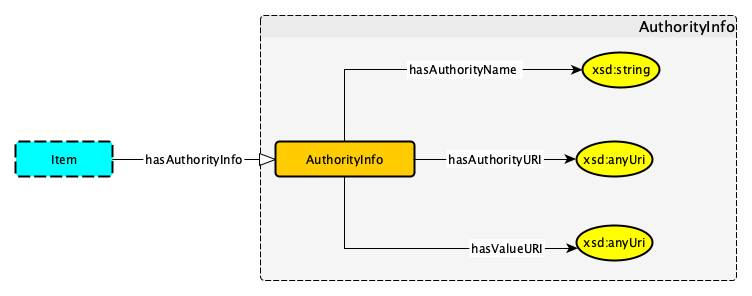

